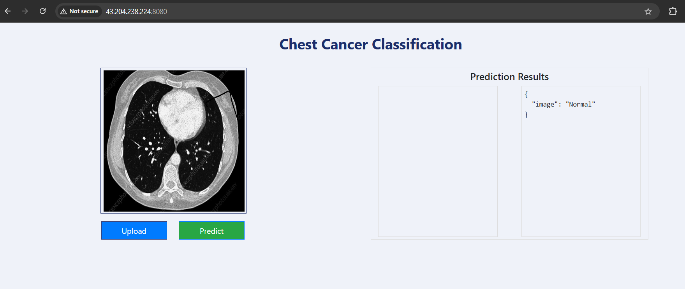
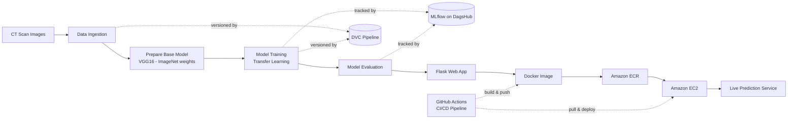
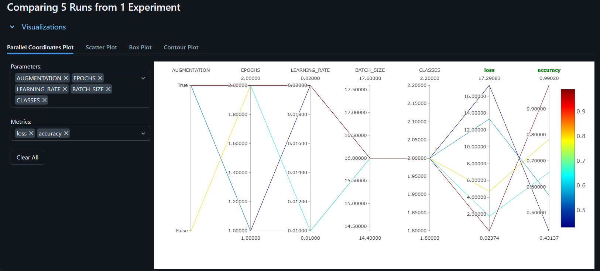
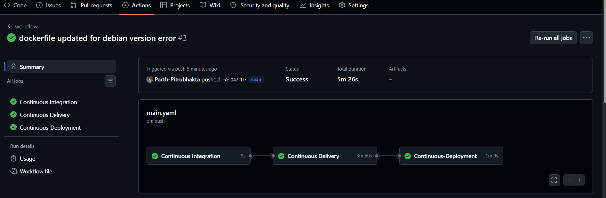

# 🫁 Chest Cancer Classification — End-to-End MLOps Project

[](https://www.python.org/)
[](https://www.tensorflow.org/)
[](https://dvc.org/)
[](https://mlflow.org/)
[](https://www.docker.com/)
[](https://aws.amazon.com/)
[](https://github.com/features/actions)
[](LICENSE)

An end-to-end deep learning application that classifies chest CT scan images as **Adenocarcinoma** or **Normal**, built with a production-style MLOps pipeline — experiment tracking, pipeline orchestration, containerized deployment, and automated CI/CD.

> 📌 This project focuses as much on the **ML engineering workflow** (versioning, tracking, packaging, automated deployment) as it does on the model itself — the goal was to practice building ML systems the way they're built in production, not just training a notebook model.

---

## 📖 Table of Contents

- [Overview](#-overview)
- [Demo](#-demo)
- [Problem Statement](#-problem-statement)
- [Dataset](#-dataset)
- [Tech Stack](#-tech-stack)
- [Architecture](#-architecture)
- [Model Details](#-model-details)
- [MLOps Pipeline](#-mlops-pipeline)
- [CI/CD & Deployment](#-cicd--deployment)
- [Project Structure](#-project-structure)
- [Getting Started](#-getting-started)
- [Running with Docker](#-running-with-docker)
- [Configuration](#-configuration)
- [Results](#-results)
- [Key Skills Demonstrated](#-key-skills-demonstrated)
- [Future Improvements](#-future-improvements)
- [Author](#-author)
- [Acknowledgements](#-acknowledgements)

---

## 🔍 Overview

This project classifies chest CT scan images into two categories — **Adenocarcinoma** (a type of lung cancer) and **Normal** — using transfer learning on a CNN backbone. Beyond the model itself, it implements a full MLOps lifecycle:

- **Data & pipeline versioning** with DVC
- **Experiment tracking** with MLflow (hosted on DagsHub)
- **Containerized packaging** with Docker
- **Automated CI/CD** with GitHub Actions
- **Cloud deployment** on AWS (ECR + EC2)
- **Web interface** for interactive predictions




## 🎥 Demo

🔗 **Live app:** [http://43.204.238.224:8080/](http://43.204.238.224:8080/)

## 🎯 Problem Statement

Given a chest CT scan image, predict whether it shows signs of **adenocarcinoma** or is **normal** — a binary image classification problem in the medical imaging domain, solved using transfer learning to work effectively with a small labeled dataset.

## 📊 Dataset

| Class | Images |
|---|---|
| Adenocarcinoma | 195 |
| Normal | 148 |
| **Total** | **343** |

Images are CT scans, resized to `224×224×3` to match the VGG16 input format. The dataset is split into training and validation sets (an 80/20-style split), with data augmentation applied during training to help the model generalize given the limited data size.

## 🛠 Tech Stack

| Category | Tools |
|---|---|
| **Language** | Python 3.8 |
| **Deep Learning** | TensorFlow / Keras, VGG16 (Transfer Learning) |
| **Pipeline & Data Versioning** | DVC (Data Version Control) |
| **Experiment Tracking** | MLflow, hosted on DagsHub |
| **Web Framework** | Flask |
| **Containerization** | Docker |
| **CI/CD** | GitHub Actions (self-hosted runner) |
| **Cloud** | AWS (IAM, ECR, EC2) |

## 🏗 Architecture



**Deployment flow:**
1. Build a Docker image of the source code
2. Push the image to **Amazon ECR** (container registry)
3. Provision an **EC2** instance
4. Pull the image from ECR onto EC2
5. Run the container on EC2, exposed via a self-hosted GitHub Actions runner

## 🧠 Model Details

Transfer learning approach using **VGG16** (pretrained on ImageNet) as a frozen feature extractor, with a custom classification head trained on the CT scan dataset.

| Layer (type) | Output Shape | Param # |
|---|---|---|
| Input | (224, 224, 3) | 0 |
| VGG16 Convolutional Base *(frozen)* | (7, 7, 512) | 14,714,688 |
| Flatten | (25088,) | 0 |
| Dense *(Softmax, 2 units)* | (2,) | 50,178 |

**Training configuration:**

| Setting | Value |
|---|---|
| Activation (output) | Softmax |
| Optimizer | Stochastic Gradient Descent (SGD) |
| Loss function | Categorical Crossentropy |
| Metric | Accuracy |

```
Total params: 14,764,866
Trainable params: 50,178
Non-trainable params: 14,714,688
```

Only the newly added dense classification head is trained; the VGG16 convolutional base stays frozen, reusing its pretrained ImageNet feature representations.

## 🔄 MLOps Pipeline

**DVC** is used to version and orchestrate the pipeline stages (data ingestion → base model preparation → training → evaluation), so every run is reproducible from a single command.

```bash
dvc init      # initialize DVC in the repo
dvc repro     # reproduce/re-run the full pipeline
dvc dag       # visualize the pipeline stages as a DAG
```

**MLflow** (hosted on [DagsHub](https://dagshub.com/parthwani1990/chest-cancer-classification-mlops.mlflow)) tracks every experiment run — parameters, metrics, and model artifacts — enabling side-by-side comparison across runs (e.g. learning rate, batch size, epochs vs. loss/accuracy).



## 🚀 CI/CD & Deployment

The `main.yaml` GitHub Actions workflow runs on every push to `main`, with three sequential jobs:

| Job | What it does |
|---|---|
| **Continuous Integration** | Lints/tests the codebase |
| **Continuous Delivery** | Builds the Docker image, authenticates with AWS, pushes the image to Amazon ECR |
| **Continuous Deployment** | Pulls the latest image on the self-hosted EC2 runner and (re)starts the container |



**AWS resources used:**
- **IAM** user scoped for ECR/EC2 access
- **ECR** repository for storing versioned Docker images
- **EC2** instance running the containerized app with a self-hosted GitHub Actions runner

## 📁 Project Structure

```
├── .github/workflows/         # CI/CD pipeline (main.yaml)
├── config/
│   └── config.yaml            # Path/URL configuration
├── src/cnnClassifier/
│   ├── components/            # Data ingestion, base model prep, training, evaluation
│   ├── config/                # Configuration manager
│   ├── constants/
│   ├── entity/                # Config data classes
│   ├── pipeline/               # Pipeline stage orchestration
│   └── utils/
├── research/                  # Exploratory notebooks
├── templates/                 # Flask HTML templates
├── dvc.yaml                   # DVC pipeline definition
├── params.yaml                 # Model/training hyperparameters
├── app.py                     # Flask web app entry point
├── main.py                    # Pipeline entry point
├── Dockerfile
├── requirements.txt
└── README.md
```

## 💻 Getting Started

```bash
# 1. Clone the repository
git clone https://github.com/Parth-Pitrubhakta/chest-cancer-classification-mlops.git
cd chest-cancer-classification-mlops

# 2. Create and activate a virtual environment
python -m venv venv
source venv/bin/activate    # Windows: venv\Scripts\activate

# 3. Install dependencies
pip install -r requirements.txt

# 4. Run the DVC pipeline (data ingestion → training → evaluation)
dvc repro

# 5. Launch the web app
python app.py
```
The app will be available at `http://localhost:8080/`.

## 🐳 Running with Docker

```bash
# Build the image
docker build -t chest-cancer-classification .

# Run the container
docker run -p 8080:8080 chest-cancer-classification
```

## ⚙️ Configuration

Model and training hyperparameters are defined in `params.yaml`:

```yaml
AUGMENTATION: True
IMAGE_SIZE: [224, 224, 3]
BATCH_SIZE: 16
INCLUDE_TOP: False
EPOCHS: 10
CLASSES: 2
WEIGHTS: imagenet
LEARNING_RATE: 0.0001
```

## 📈 Results

| Metric | Value |
|---|---|
| Validation Accuracy | `TODO` |
| Validation Loss | `TODO` |
| Precision (Adenocarcinoma) | `TODO` |
| Recall (Adenocarcinoma) | `TODO` |

> Given the small dataset size (343 images), results are reported on a held-out validation set. Cross-validation is recommended for a more robust performance estimate.

## 🏆 Key Skills Demonstrated

- End-to-end **MLOps workflow design** (versioning → training → tracking → packaging → deployment)
- **Transfer learning** for computer vision with limited labeled data
- **Experiment tracking & reproducibility** with MLflow + DVC
- **Containerization** and **cloud deployment** (Docker, AWS ECR, AWS EC2)
- **CI/CD pipeline automation** with GitHub Actions (self-hosted runners)
- **Full-stack delivery**: model training → REST/web interface → production deployment

## 🔮 Future Improvements

- [ ] Expand dataset size and add more disease classes (multi-class classification)
- [ ] Hyperparameter tuning (learning rate scheduling, longer training with early stopping)
- [ ] Add Grad-CAM visualizations for model interpretability
- [ ] Add unit/integration tests to the CI pipeline
- [ ] Add model monitoring and drift detection post-deployment
- [ ] Migrate to a managed container service (e.g. ECS/Fargate) for better scalability than a single EC2 instance

## 👤 Author

**Your Name**
📧 parth.pitrubhakta.mail.work@gmail.com · 🔗 [LinkedIn](https://linkedin.com/in/parthpitrubhakta) · 💻 [GitHub](https://github.com/Parth-Pitrubhakta)

## 🙏 Acknowledgements

- [VGG16](https://arxiv.org/abs/1409.1556) pretrained weights via Keras Applications
- [DVC](https://dvc.org/) and [MLflow](https://mlflow.org/) documentation
- [DagsHub](https://dagshub.com/) for free MLflow hosting

---

⭐ If you found this project useful, consider giving it a star!
